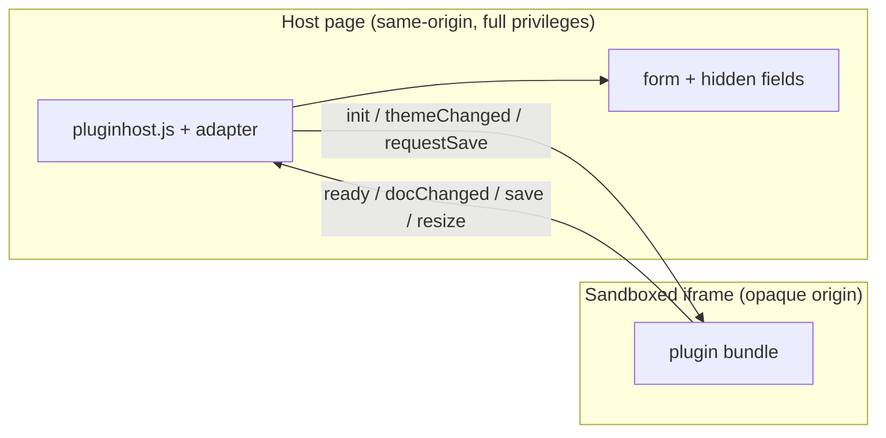

# Plugin platform

The `pluginhost` package is the reusable, plugin-agnostic host glue that lets a
GoFastr app mount a **heavy-JavaScript plugin** as a genuinely third-party,
isolated client module. It was distilled out of the first such plugin (the
[`richtext`](richtext-editor.md) editor) so a second plugin ([`mermaid`](mermaid.md))
could reuse it instead of reimplementing the iframe / broker / manifest /
capability / framing-header plumbing.

This page is the platform reference. The authoritative protocol contract lives in
[`design/protocol-v1.md`](design/protocol-v1.md); the why behind it lives in
[`PLAN.md`](PLAN.md) and [`DECISIONS.md`](DECISIONS.md).

## TL;DR

A plugin ships a prebuilt JS bundle (`go:embed`'d), served **same-origin**. The
bundle runs inside an **opaque-origin sandboxed iframe** (`sandbox="allow-scripts"`
**without** `allow-same-origin`). The host page and the frame talk **only** over a
versioned `postMessage` capability bridge. Everything else — host DB, cookies,
CSRF token, `localStorage`, host DOM/globals, other plugins' data, the network —
is **unreachable** from the frame. That is the third-party guarantee, structural.



## The isolation model

The frame document is an **opaque origin**: `sandbox="allow-scripts"` is present
and `allow-same-origin` is **never** added. Consequences:

- `document.cookie`, `localStorage`, `sessionStorage`, `window.parent.document`,
  the CSRF token, and every host global are unreachable from the frame.
- The frame's `origin` is the literal string `"null"`, which is why origin-string
  checks are a trap (see [Source validation](#source-validation)).
- The frame has **no network capability**. Its only outbound channel is a granted
  capability RPC over `postMessage`.

The frame is served **same-origin** from the plugin's own asset route, so the
host app's strict CSP is satisfied by `default-src 'self'` with **zero core CSP
edits**. The isolation comes from the sandbox, not from cross-origin serving.

`allow-same-origin` is forbidden by construction: `pluginhost.Manifest.Validate`
rejects any sandbox token list containing it, so a mis-configured plugin fails
loudly at construction rather than silently de-opaquing the frame at runtime.

## The versioned postMessage capability protocol

Summarized from [`design/protocol-v1.md`](design/protocol-v1.md) §3–§5. Every
message in both directions is one structured-clone object:

```jsonc
{
  "v": 1,                                   // envelope version; bump = breaking
  "id": "h-42",                             // correlation id (host "h-N", plugin "p-N")
  "type": "request" | "response" | "event", // response echoes the request's id
  "src":  "host" | "plugin",
  "method": "init",                         // request & event only
  "params": { },                            // request/event payload
  "result": null,                           // response only
  "error":  null                            // response only: { "code", "message" }
}
```

- **Handshake.** The host cannot know when the frame's JS finished loading, so
  **the plugin speaks first**: `ready` → host replies `init`. The generic broker
  owns this handshake; an adapter only adds plugin-specific behaviour.
- **Correlation.** `request` → `response` matched by `id`. `event` is
  fire-and-forget. Requests carry a 5 s timeout (`E_TIMEOUT`).
- **Capability errors.** A plugin→host request whose capability was not granted
  gets `error.code = "E_CAPABILITY_DENIED"` (HTTP 412 on the route side).

### Method tables (v1)

**host → plugin**

| method | type | params |
|---|---|---|
| `init` | event | `{doc, markdown, tokens, scheme, capabilities, schemaVersion}` |
| `themeChanged` | event | `{scheme, tokens}` |
| `requestSave` | request | `{}` → `{doc, markdown, schemaVersion}` |
| `uploadResult` | event | `{reqId, url}` or `{reqId, error}` |
| `teardown` | request | `{}` → `{}` |

**plugin → host**

| method | type | params | capability |
|---|---|---|---|
| `ready` | event | `{version, schemaVersion, minHeight}` | — |
| `docChanged` | event | `{doc, markdown, dirty, rev}` | `document:write` |
| `save` | event | `{doc, markdown, schemaVersion}` | `document:write` |
| `requestUpload` | event | `{reqId, name, type, bytes}` | `upload:images` |
| `resize` | event | `{height}` | — |
| `focusChanged` | event | `{focused}` | — |
| `metric` | event | `{name:"keystroke", p50, p99, count, samplesMs}` | — |

### Source validation

Both sides validate `event.source`, **never** `event.origin`:

- Host drops any message whose `event.source !== iframe.contentWindow`.
- Frame drops any message whose `event.source !== window.parent`.

An opaque-origin frame's `origin` is the string `"null"`, so origin-string
checks would either always-fail or be bypassable. Source identity is the
load-bearing check (GLM caught this in the pressure-test; see
[`DECISIONS.md`](DECISIONS.md)).

## The capability model

Capabilities **reuse** GoFastr's existing `resource:verb` auth-scope grammar —
the same `auth.HasScope` / `auth.RequireScope` checker the rest of the framework
uses. There is **no parallel capability registry** invented for plugins.

| capability | grants | absent → |
|---|---|---|
| `document:read` | frame receives `init.doc` | starts empty |
| `document:write` | host accepts `docChanged` / `save` | read-only |
| `upload:images` | `requestUpload` honored (image mime only) | paste-image disabled |
| `theme:read` | receives `tokens` + `themeChanged` | default tokens |
| `navigation:intercept` | _(deferred to Phase 1)_ | — |

The gate is one line — [`pluginhost.Allow`](#the-platform-api):

```go
func Allow(r *http.Request, capability string, devGrantAll bool) bool {
    if devGrantAll { return true }              // Phase-0 demo / tests only
    return auth.HasScope(r.Context(), capability)
}
```

Semantics when `devGrantAll` is false: no token in context ⇒ `HasScope` true
(session/JWT, unscoped by design); a scoped token ⇒ true only if the token's
scopes grant the capability.

## Trust tiers

v1 has a **single** isolation tier: the opaque-origin sandboxed iframe. Every
plugin — first-party-maintained or not — runs in it. There is no "trusted
first-party" shortcut: the same boundary, the same capability grants, the same
"no reaching into host internals" rule apply uniformly. This is decision **D3**
in [`PLAN.md`](PLAN.md).

A future **cross-origin tier** (a plugin served from a real distinct origin,
e.g. a vendor CDN) is anticipated but not built. It would carry a *stronger*
guarantee (no same-origin asset sharing) at the cost of CORP/CORS bookkeeping;
the capability vocabulary and protocol would be unchanged. The `isolation`
field on [`Manifest`](#the-platform-api) is the extension point — today only
`sandbox-iframe-opaque` is accepted, and `Validate` rejects anything else.

## The header / CSP contract

This is the load-bearing platform responsibility and the surprise of Phase 0.
GoFastr's global security middleware sends, on **every** response:

- `X-Frame-Options: DENY`
- `Content-Security-Policy: frame-ancestors 'none'`
- `Cross-Origin-Resource-Policy: same-origin`

These are correct app defaults — but they **also** block the host page from
framing the plugin's own document, and block the opaque (`"null"`-origin) frame
from fetching its own JS/CSS. So for exactly the **framed first-party assets**,
[`pluginhost.AssetServer`](#the-platform-api) relaxes embedding:

1. **Drop** `X-Frame-Options`. No `same-origin-ancestor` mode works for an
   opaque frame; `frame-ancestors` is the modern, precise control. (A buffering
   middleware upstream may re-emit XFO after the `Del`, so the *effective*
   framing control is the CSP directive below, which browsers honour **over**
   XFO.)
2. **CSP** `frame-ancestors 'self'` — the **embedder** (host page) is
   same-origin, which is what `frame-ancestors` checks. This supersedes any
   `XFO: DENY` and is the load-bearing framing permission.
3. **CORP** `cross-origin` — so the opaque frame may fetch these public,
   secret-free static assets.

The framed-asset CSP is fixed:

```
default-src 'self'; img-src 'self' data:; style-src 'self' 'unsafe-inline';
frame-ancestors 'self'; base-uri 'self'
```

- `style-src 'unsafe-inline'` is required: ProseMirror sets inline style
  attributes and the theme bridge injects a `<style>:root{…}` token block.
- `script-src` stays `'self'` — editor JS is an external same-origin script, so
  **script isolation holds**. No `'unsafe-inline'` for scripts.
- `frame-ancestors 'self'` permits the same-origin host page (and nothing else)
  to embed the frame; the frame's own opaque origin is irrelevant to
  `frame-ancestors`.

Host-page scripts (the broker / adapter) are **non-framed**: they are served
plain, with no CORP/CSP relaxation. They are same-origin and CSP-clean (external
`<script src>`, no inline JS). These gotchas are recorded in
[`DECISIONS.md`](DECISIONS.md) "Phase 0 — DONE".

## Theming across the boundary

CSS custom properties do **not** inherit across an iframe boundary, so the host
**bridges resolved token values**:

1. Host enumerates its `--*` tokens and reads the **resolved** value via
   `getComputedStyle(document.documentElement).getPropertyValue(name)`.
2. Sends the full map in `init.tokens` (and again in `themeChanged.tokens`).
3. The frame writes a single `<style>:root{ --x:…; --y:…; }</style>` into its own
   document head. Plugin CSS is **token-only** (`var(--color-text)`, …) — zero
   bespoke hex — so it matches the host palette by construction.
4. On a `data-color-scheme` flip the host re-resolves and re-sends; the frame
   swaps its `:root` block synchronously (no FOUC).

## Relation to gofastr issue #37

This platform is the **client mirror** of gofastr issue **#37** (server-side
process-isolated modules). The two sides share the same capability vocabulary
— the `resource:verb` scope grammar (`document:read`, `upload:images`, …) — so a
plugin's client capability and its server-side RPC authorization are the *same*
checker (`auth.HasScope`) against the *same* scope tokens. The editor plugin is
the forcing function that proved the third-party contract on the client; #37
does the equivalent on the server. See [`DECISIONS.md`](DECISIONS.md) "Origin".

## The platform API

The `pluginhost` package exposes:

| symbol | purpose |
|---|---|
| `Manifest` | declarative description of a client module: `Entry`, `ScriptHash`, `Isolation`, `Sandbox`, `Capabilities`, `MinHeight`, `Schema`, `Title`. `Validate()` enforces the v1 invariants (no `allow-same-origin`; `allow-scripts` required). |
| `ClientModule` | `{ Name, Manifest, Assets fs.FS }` — the unit a plugin registers. |
| `IsolationSandboxOpaque` / `DefaultSandbox` | `"sandbox-iframe-opaque"` / `"allow-scripts"`. |
| `AssetServer` | serves a plugin's embedded assets with correct Content-Types AND the framing/CORP/CSP relaxation on framed assets. `NewAssetServer(fsys, prefix, specs)` → `AddBytes(...)` → `Register(rt)`. |
| `AssetSpec` | `{ Name, ContentType, Framed }`. `Framed` marks the assets that make up the sandboxed frame. |
| `Allow` | the capability gate: `Allow(r, capability, devGrantAll)` → `auth.HasScope`. |
| `MountMarker` / `MountConfig` | the generic `data-fui-plugin*` mount marker + hidden-field HTML the broker scans for. |
| `BrokerScriptURL` / `RegisterBrokerRoute` / `UIHostOption` | serving + injecting the generic host broker (`host/pluginhost.js`). |
| `BrokerRegistration` | the JS shape an adapter passes to `window.__gofastrPluginHost.register(name, {...})`. |

### Build a plugin on pluginhost

A plugin composes the platform pieces in its `Init` and ships a thin JS adapter
that registers plugin-specific event handlers with the generic broker. The shape
(verbatim from [`mermaid/plugin.go`](../mermaid/plugin.go)):

```go
package myplugin

import (
    "net/http"

    "github.com/DonaldMurillo/gofastr-plugins/pluginhost"
    "github.com/DonaldMurillo/gofastr/framework"
    "github.com/DonaldMurillo/gofastr/framework/uihost"
)

const (
    Name        = "myplugin"
    RoutePrefix = "/__gofastr/plugin/myplugin"
    EntryURL    = RoutePrefix + "/app.html"
    AdapterURL  = RoutePrefix + "/adapter.js"
    SaveURL     = RoutePrefix + "/save"
    SchemaVer   = "myplugin-v1"
)

func New(opts ...Option) *Plugin {
    p := &Plugin{
        capabilities: []string{"document:read", "document:write", "theme:read"},
        manifest: pluginhost.Manifest{
            Entry:        EntryURL,
            Isolation:    pluginhost.IsolationSandboxOpaque,
            Sandbox:      []string{pluginhost.DefaultSandbox},
            Capabilities: []string{"document:read", "document:write", "theme:read"},
            MinHeight:    "240px",
            Schema:       SchemaVer,
            Title:        "My plugin",
        },
    }
    // apply opts...
    if err := p.manifest.Validate(); err != nil {  // fail loud, never de-opaque
        panic("myplugin: invalid manifest: " + err.Error())
    }
    return p
}

func (p *Plugin) Init(app *framework.App) error {
    rt := app.Router()
    pluginhost.RegisterBrokerRoute(rt)        // idempotent across plugins

    srv := pluginhost.NewAssetServer(framedAssets(), RoutePrefix, []pluginhost.AssetSpec{
        {Name: "app.html", ContentType: "text/html; charset=utf-8", Framed: true},
        {Name: "app.js",   ContentType: "text/javascript; charset=utf-8", Framed: true},
        {Name: "app.css",  ContentType: "text/css; charset=utf-8", Framed: true},
    })
    srv.AddBytes(AdapterURL, "text/javascript; charset=utf-8", false, adapterJSBytes)
    srv.Register(rt)

    rt.Post(SaveURL, http.HandlerFunc(p.handleSave))  // gates on pluginhost.Allow
    return nil
}

// allow is the one capability gate — delegated to the platform.
func (p *Plugin) allow(r *http.Request, cap string) bool {
    return pluginhost.Allow(r, cap, p.devGrantAll)
}

// UIHostOption injects the platform broker FIRST, then this plugin's adapter.
func UIHostOption() uihost.Option {
    return uihost.WithExtraScripts(pluginhost.BrokerScriptURL, AdapterURL)
}

// Mount renders the generic marker + hidden fields; the broker builds the iframe.
func Mount(cfg MountConfig) render.HTML {
    return pluginhost.MountMarker(pluginhost.MountConfig{
        Plugin: Name, DocID: cfg.DocID, MinHeight: cfg.MinHeight, Doc: cfg.Doc,
        Attributes: []pluginhost.Attribute{{Name: "data-fui-plugin-for", Value: cfg.Field}},
        Fields:     []pluginhost.Field{{Name: cfg.Field}},
    })
}
```

The mount marker the broker scans for:

```html
<div data-fui-plugin="myplugin"
     data-fui-plugin-docid="demo"
     data-fui-plugin-minheight="240px"
     data-fui-plugin-for="my_field"></div>
<input type="hidden" name="my_field">
```

The JS adapter registers with the generic broker, which owns the envelope,
source check, `ready`→`init` handshake, and the generic observability hooks
(`iframe.__pluginReady` / `__pluginProbes` / `__pluginTheme` / `__pluginLastMetric`):

```js
window.__gofastrPluginHost.register("myplugin", {
  manifest: { /* → pluginhost.Manifest, serialized to JS */ },
  onEvent(method, params, api) {
    // api = { request, sendEvent, iframe, marker, form }
    // handle plugin-specific events: docChanged, save, …
  },
});
```

The two shipped plugins — [`richtext`](richtext-editor.md) and
[`mermaid`](mermaid.md) — are working references for this shape.

## Registry

The curated index is [`plugins.json`](../plugins.json) at the repo root. It is a
**convention, not a service**: a JSON manifest + this docs page. There is no
runtime discovery server — apps import a plugin package directly by its
`modulePath` and mount it with `framework.RegisterPlugin`. Each row mirrors the
plugin's own identity/route constants and its `pluginhost.Manifest`.

### Consuming it

The index is consumed **by copy, not by import**. Tagging `vX.Y.Z` here
publishes a release with `plugins.json` attached; a host — GoFastr's docs site
first — fetches that asset as it deploys, vendors it, and generates a page per
plugin from the rows:

```
plugins.json (this repo, source of truth)
        │  tag vX.Y.Z -> release.yml validates, stamps provenance, attaches it
        ▼
GitHub release asset
        │  fetch + vendor at deploy
        ▼
gofastr (parses its own copy, generates a page per plugin)
```

```sh
# Pinned to a known release — what a reproducible deploy should use.
curl -fsSL -O https://github.com/DonaldMurillo/gofastr-plugins/releases/download/v0.1.0/plugins.json

# Or always the newest release.
curl -fsSL -O https://github.com/DonaldMurillo/gofastr-plugins/releases/latest/download/plugins.json
```

The published artifact is the JSON file, so this repo deliberately exposes **no
Go API** for it. That is the point rather than an omission: GoFastr consuming a
Go package here would mean the framework importing a repo that imports the
framework — a module cycle — and it would pull chromedp and every embedded JS
bundle into the core's `go.mod`, the outcome this whole repo split exists to
avoid. A file copy has neither problem.

### Provenance

A copy's weakness is that it forgets where it came from: once vendored, a
year-old `plugins.json` looks exactly like a fresh one. So the release workflow
stamps the **published** copy — never the one in git — with the release it came
from:

```json
"release": {
  "tag": "v0.1.0",
  "commit": "78800e3e...",
  "published": "2026-07-16T23:14:42Z",
  "source": "https://github.com/DonaldMurillo/gofastr-plugins"
}
```

A host can render or log that, and a stale vendored copy becomes visible instead
of silent. The file in git carries no stamp, and a test enforces that — a
hand-written one would be a lie the moment it was committed.

Note the version axes, which move independently: `registryVersion` versions the
file's SHAPE (bump it on a breaking field change — vendored copies are then
stale), `release.tag` says which release a copy came from, and each row's
`version` reports that plugin's own release.

### Changing it

`plugins.json` is hand-maintained — update a plugin's row in the same change
that bumps its `Version` or capabilities. Because a stale row is invisible to
every other test, [`internal/registry`](../internal/registry) guards it: rows
must cover exactly the plugin packages in the repo, each row's `routePrefix`
must equal the package's own const, no row may request `allow-same-origin`, and
the parser **rejects unknown fields** — so a new JSON key must be added to the
structs there in the same change, rather than being silently dropped from every
generated page. Those structs document the schema; treat a change to them as a
change to a published contract.

Those same guards run inside the release workflow before the asset is attached,
so a broken index fails the release rather than reaching a host — where it would
be invisible until a page rendered wrong.
