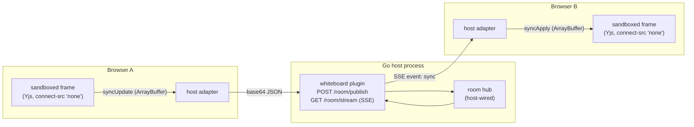

# Whiteboard — collaboration without a socket in the cage

The whiteboard is the collaborative plugin: two (or more) browsers drawing on
one board, live, with cursors. The interesting part is not the pen — it is
that the sandboxed frame **collaborates with people it cannot reach**.

The framed CSP sets `connect-src 'none'`. That directive is the exfiltration
guard the whole isolation design rests on, and a collaborative plugin looks
like it needs it removed: sockets, polling, something. **It does not.** The
document is a [Yjs](https://github.com/yjs/yjs) CRDT, and CRDT updates are
order-insensitive binary blobs. They cross the postMessage bridge like any
other plugin payload, and the **host owns the only network connection**,
relaying blobs between browsers. Nothing about the frame's cage changes.

This lands the "Phase 4 (collaboration/CRDT, presence)" idea parked in
[`DECISIONS.md`](DECISIONS.md) without weakening the isolation contract by
one directive.

## Architecture



- **The frame** (`whiteboard/js/`, Yjs + a small canvas controller bundled to
  one ~88 KB IIFE) draws, erases, renders remote cursors, and emits/consumes
  opaque Yjs update blobs over protocol v1. It never fetches, ever — the
  bundle wraps `fetch`/`XHR`/`EventSource`/`WebSocket`/`sendBeacon` at boot
  and publishes every attempt on `window.__wbNetProbe`, so "the frame issued
  no network request" is asserted, not assumed.
- **The adapter** (`whiteboard/host/adapter.js`) is the network leg the frame
  is forbidden to have: it POSTs frame updates to `/room/publish` and feeds
  SSE-delivered updates back in as `syncApply` events.
- **The plugin** (`whiteboard/`) owns the routes and the capability gate. The
  room hub itself is host-wired — the example app ships one
  (`example/whiteboard.go`) with SSE fan-out, replay-on-join and presence.
- **Persistence is the room's accumulated Yjs state.** The hub appends every
  published update to a per-room history; a joiner is replayed the whole
  history and converges. Yjs updates are idempotent to re-apply, so replay is
  safe for rejoining participants too. Compacting the history would require
  interpreting the blobs in Go — exactly the work the host is structured not
  to do — so the demo hub bounds memory instead (32 MiB per room, then
  `E_ROOM_FULL`: loud, never silent).

## The capability: `sync:room`

Collaboration is egress the host explicitly turns on. `sync:room` appears in
the grant set exactly when the host passes [`WithRoomHub`][1], which gates
both routes:

| route | method | gate |
|---|---|---|
| `/__gofastr/plugin/whiteboard/room/stream?docId=demo` | GET (SSE) | `sync:room` |
| `/__gofastr/plugin/whiteboard/room/publish` | POST | `sync:room` |

Without a hub the plugin still constructs and mounts — the board draws, the
frame shows "no room hub — local only" — but both routes fail closed (403
`E_CAPABILITY_DENIED`; 503 `E_NO_ROOM_HUB` under `WithDevGrantAll`, whose
bypass skips the capability gate entirely). A grant that *implies* `sync:room`
(including wildcards like `sync:*` or `*:*`) without a hub is a construction
panic, matched with the framework's `access.ScopeMatch` grammar — the same
matcher the runtime gate uses, so wildcard grants cannot slip between the two
(datagrid's lesson).

`pluginhost.Allow` is a capability gate, **not authentication**: it passes
for anonymous callers. A host exposing a sensitive board checks the session
inside its own hub functions before yielding anything.

## Identity is the host's to decide

Awareness in collaborative editors normally carries user names. Here the
frame is untrusted, so **the host hands it an opaque participant id and a
colour, nothing else**:

- The hub assigns `p-1`, `p-2`, … plus a palette colour in the SSE `hello`
  event; the adapter forwards them into the frame via `syncStatus`.
- The frame draws in its assigned colour — there is no colour picker in the
  cage to override the host's decision with.
- Presence carries `{pid, color, x, y, down}` — **never a name**. Remote
  cursors render as coloured rings with no label.
- A client cannot forge another participant's colour: presence publishes
  carry only coordinates, and the hub attaches the colour it assigned.

This is an isolation property, not a UX detail: the frame learns how many
participants and in what colours, and cannot learn or lie about more.

## Convergence: drop, draw, reconnect

The demo page's **Drop connection** control (and `window.__gofastrWhiteboardDemo`
on the host page) closes the SSE stream and stops relaying. Drawing continues
locally — the CRDT accumulates offline edits, and the frame says so
("offline — drawing locally").

On reconnect the adapter:

1. reopens the stream (the hub replays the room's persisted state — everyone
   else's offline edits arrive), and
2. asks the frame for its full state (`syncSnapshot` request → ArrayBuffer)
   and publishes it — this side's offline edits go out.

Yjs merges both directions; the union of everyone's strokes wins, nobody's
edits are lost to last-writer. Erases are CRDT deletes and converge the same
way.

## Protocol additions (whiteboard-v1)

On top of [protocol v1](design/protocol-v1.md):

| direction | method | shape | capability |
|---|---|---|---|
| plugin → host | `syncUpdate` (event) | `{update: ArrayBuffer}` | `sync:room` |
| plugin → host | `presenceUpdate` (event) | `{x, y, down}` (normalized coords) | `sync:room` |
| plugin → host | `boardState` (event) | `{strokes, pid, color, connected, participants, updatesSent, bytesSent, updatesReceived, bytesReceived}` | — |
| host → plugin | `syncApply` (event) | `{update: ArrayBuffer}` | — |
| host → plugin | `presenceApply` (event) | `{pid, color, x, y, down}` — no name | — |
| host → plugin | `syncStatus` (event) | `{connected, pid, color, participants}` | — |
| host → plugin | `syncSnapshot` (request) | `{}` → `{state: ArrayBuffer}` | — |

Updates cross the bridge as structured-clone `ArrayBuffer`s and the wire as
base64 inside JSON/SSE text. Strokes are normalised `[0..1]` coordinates
quantized to 1/1000, so boards render identically at any frame size.

## Observability

The adapter mirrors the room's live state onto the iframe element (the parent
cannot read into the opaque frame): `__wbReady`, `__wbConnected`, `__wbPid`,
`__wbColor`, `__wbParticipants`, `__wbStrokes`, `__wbSent`/`__wbRecv`
(`{updates, bytes}`), `__wbSyncEnabled`. The demo page's relay-telemetry
strip renders these live; the e2e suite asserts against them. Inside the
frame, `window.__wbDebug` exposes stroke dumps and traffic counters, and
`window.__wbNetProbe` records every (blocked) network API attempt.

## Usage

```go
hub := newRoomHub() // your implementation, or copy example/whiteboard.go
app.RegisterPlugin(whiteboard.New(
    whiteboard.WithRoomHub(hub.Subscribe, hub.Publish),
    whiteboard.WithDemoPage(),          // serves /whiteboard
    // whiteboard.WithDevGrantAll(),    // demo/tests only
))
```

`Mount(whiteboard.MountConfig{DocID: "design-review"})` renders the mount
marker; two mounts sharing a `DocID` collaborate. There is no form field to
round-trip — the room hub owns persistence, not the enclosing form.

## Bounds

- One publish body is capped at 1 MiB (`E_BAD_REQUEST` over).
- The demo hub caps a room's history at 32 MiB (`E_ROOM_FULL`, never silent).
- Slow SSE consumers are dropped, not buffered unboundedly: their data lives
  in the room history, and reconnect replays what they missed.

[1]: (whiteboard.WithRoomHub)
